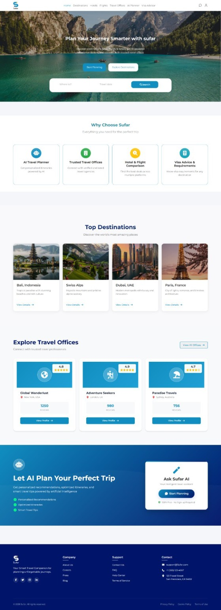
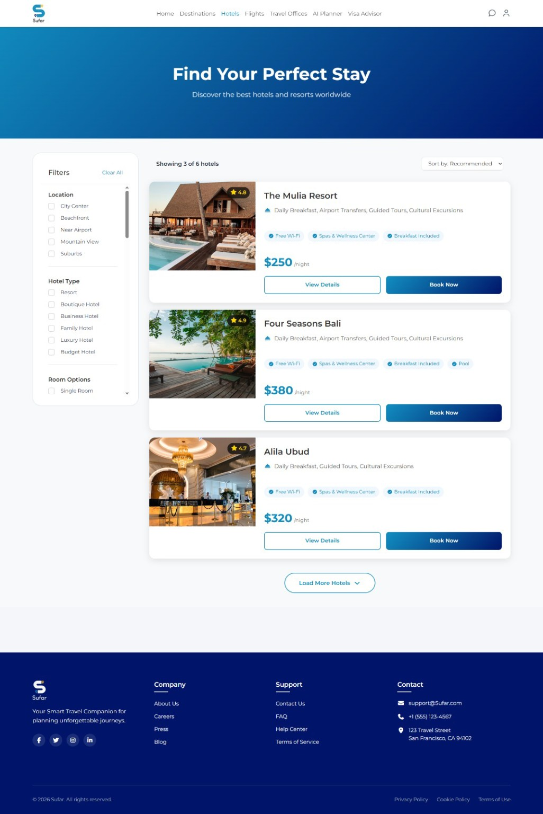
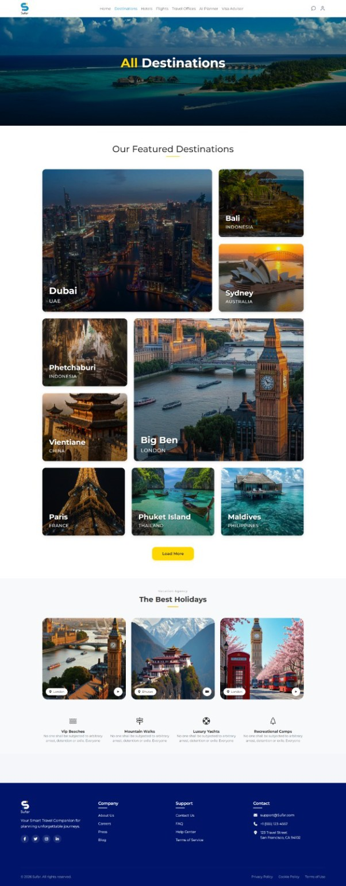
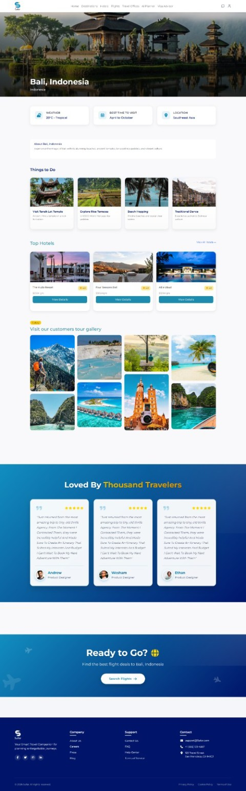
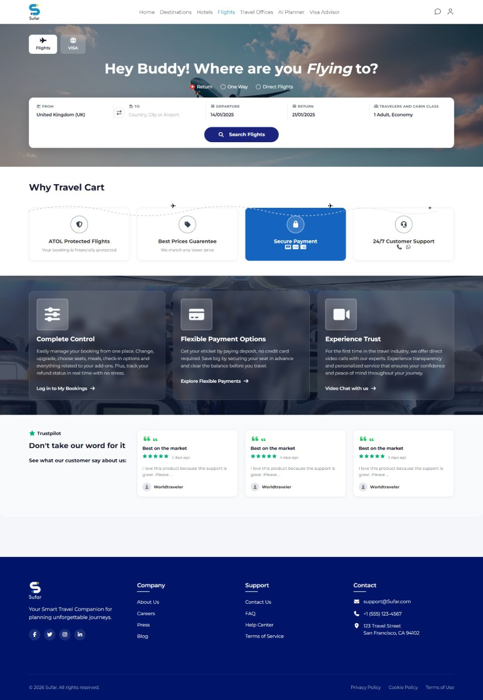

# Hi 👋 I'm Aya Elsawaf

### Front-End Developer · UI/UX Designer · Graphic Designer

---

## 🙋‍♀️ About Me

- 🎓 B.Sc. Computer Science — Obour Institutes (2026) | **Ranked 1st in class**
- 💻 Front-End Developer building responsive, interactive web apps
- 🚀 Graduated with **Sufar** — a full-stack travel platform with AI Planner & Chatbot
- 🎨 UI/UX & Graphic Design as a creative superpower for pixel-perfect UIs
- 📍 Egypt

---

## 🛠️ Tech Stack

### Frontend

### Tools & Design

---

# 🚀 Featured Project

## ✈️ Sufar – AI Travel Platform

  

A modern **Full-Stack Travel Platform** built using **React.js**, **Node.js**, **Express.js**, and **MongoDB**.

### ✨ Features

- 🤖 AI Trip Planner
- 💬 AI Chatbot
- 🌍 Destination Explorer
- 🏨 Hotel Booking
- ✈️ Flight Booking
- 🏢 Travel Offices
- 🛂 Visa Advisor
- 📱 Responsive Design
- 🔐 Authentication System
- ⚙️ Admin Dashboard

---

## 📸 Project Gallery

  
  

  
  

---

### 🛠️ Technologies

- React.js
- Node.js
- Express.js
- MongoDB
- REST API

---

### 🔗 Live Demo

https://sufar-website-graduation-project.vercel.app

### 💻 GitHub Repository

https://github.com/Ayaelsawaf/Sufar-Website-Graduation-Project

---

## 📊 GitHub Stats

---

### 📫 Connect With Me

📧 **Email:** aelsawaf67@gmail.com

💼 **LinkedIn:** https://linkedin.com/in/aya-elsawaf-441274272

🌐 **Portfolio:** https://sufar-website-graduation-project.vercel.app

---

*"Good design is invisible — great code makes it feel effortless."* ✨

